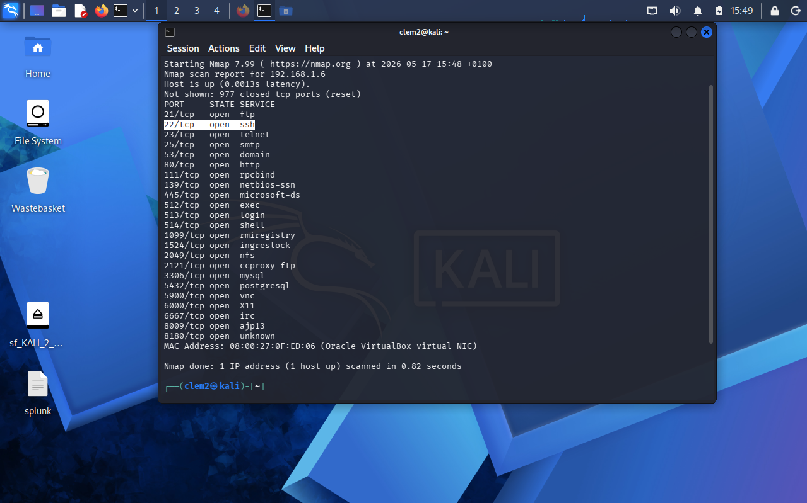
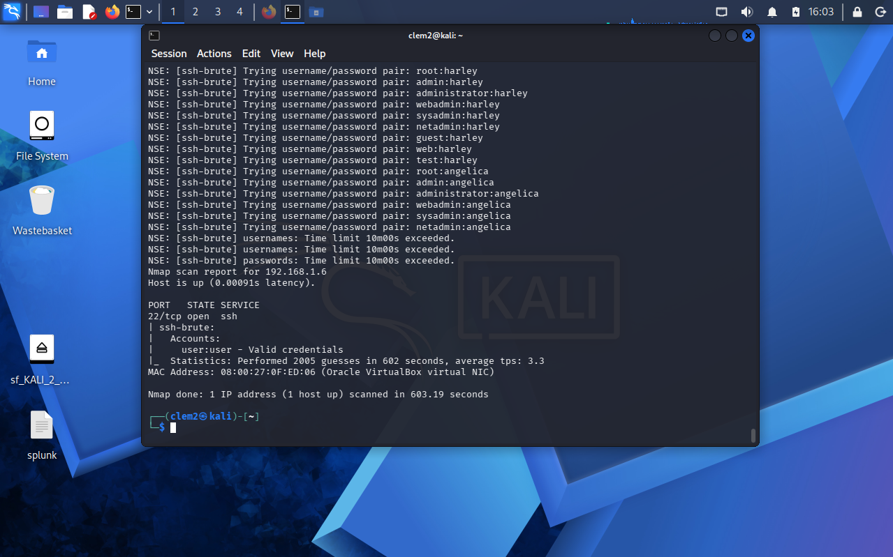

# Demonstrating the Risk of Weak Passwords and Exposed Services

A hands-on cybersecurity lab exploring SSH brute-force risks using Nmap NSE on a Metasploitable environment.

## Introduction & Overview

This project simulates a real-world security scenario where an exposed SSH service is evaluated for potential authentication weaknesses using automated brute-force techniques. The aim was to understand how attackers identify open services, assess their security posture, and exploit weak credentials in a controlled environment.

The exercise demonstrates the importance of securing remote access services and enforcing strong authentication policies.

## Objective

- Identify exposed services on a target machine
- Analyse the security posture of SSH (port 22)
- Simulate brute-force authentication attempts using Nmap NSE
- Understand the risks of weak credentials and exposed services
- Demonstrate how SSH can become an attack entry point if poorly secured

## Environment & Tools

### Operating Systems

- Kali Linux (attacker machine)
- Metasploitable 2 (target machine)

### Tools Used

- Nmap (network scanning and NSE scripting framework)
- SSH service (port 22 observed on target system)

### Lab Setup

- Isolated virtual lab environment (host-only network between attacker and target machines)

## Technical Skills Demonstrated

- Network scanning and service enumeration
- Vulnerability assessment using Nmap
- Security analysis of exposed network services
- Understanding SSH authentication mechanisms
- Brute-force simulation using NSE scripts
- Attack surface identification

## Implementation Process

### Phase 1: Reconnaissance

A network scan was performed to identify active hosts and open ports on the target system.

```bash
sudo nmap -sS <192.168.1.6>
```

This scan revealed that SSH (port 22) was open and accessible.


> Insert screenshot here

## Phase 2: Vulnerability Analysis

The SSH service on port 22 was identified as exposed, which poses a potential security risk. SSH is a remote access protocol that allows users to log into a system over a network, making it a direct entry point into the system. If weak credentials are used, an attacker could potentially gain unauthorised access, increasing the system’s overall attack surface.

An attacker’s perspective was also considered during this phase by evaluating how the service would behave under automated login attempts. Specifically, the SSH service was assessed for resistance against brute-force attacks, where tools repeatedly try multiple username and password combinations. The analysis focused on whether the system would limit repeated login attempts, introduce delays, or enforce account lockout mechanisms after multiple failures.

Based on observations in this lab environment, no visible brute-force protection mechanisms were detected. This indicated that the SSH service could be subjected to automated password-guessing attacks, making it a viable attack surface for exploitation in the next phase.

## Phase 3: Exploitation Simulation

An Nmap NSE brute-force script was used to simulate password-guessing attempts against the SSH service.

```bash
nmap --script ssh-brute -p 22 <target_ip>
```

The script attempted multiple authentication combinations against the service, demonstrating how weak credentials can be targeted using automated tools.


> Insert screenshot here or link to saved Nmap output

## Phase 4: Results Observation

The brute-force process ran for approximately 601 seconds, highlighting how exposed SSH services combined with weak authentication can become a realistic attack vector in a short amount of time.

## Results & Key Findings

### Key Risks Identified

- SSH service exposed on port 22
- Weak authentication increases risk of unauthorised access
- No visible brute-force protection mechanisms detected
- Service is vulnerable to automated login attempts

### Remediation Summary

| Vulnerability | Risk | Recommended Mitigation |
|---|---|---|
| Weak SSH authentication | Unauthorised access | Enforce strong password policies |
| Open SSH port (22) | Increased attack surface | Restrict access via firewall or IP allowlisting |
| No brute-force protection | Automated attacks possible | Implement Fail2Ban or rate limiting |

## Challenges & Lessons Learned

This exercise highlighted how quickly an exposed service can become a target when weak authentication is present. It also reinforced the importance of thinking from an attacker’s perspective when evaluating system security.

Even in controlled environments, simple misconfigurations such as exposed services and weak credentials can significantly increase risk.

## Conclusion & Future Work

This lab demonstrated how exposed SSH services combined with weak authentication can create a direct attack path into a system.

### Future Improvements

- Implement and test Fail2Ban protection
- Add firewall rules to restrict SSH access
- Automate reporting of scan results using Python
- Expand testing to other services (FTP, HTTP, SMB)
